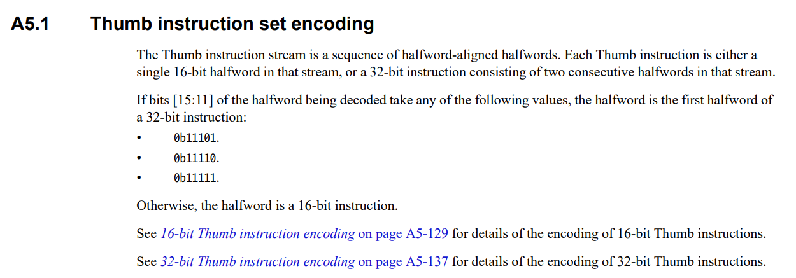
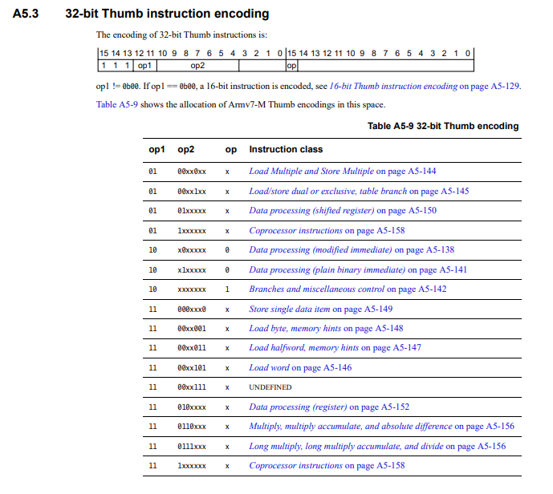
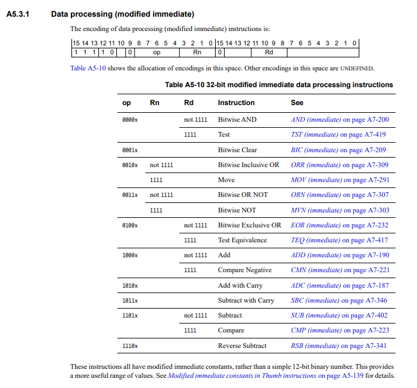
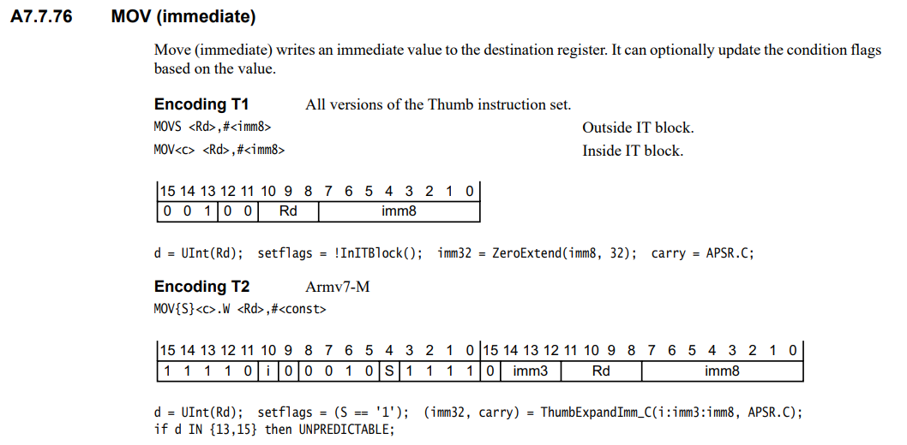

# Introduction to ARM Architecture

```
┌────────────────┐              ┌────────────────┐
│                │              │┌──────────────┐│
│                │              ││     CODE     ││
│   PROCESSOR    │ ―― ADDRESS ―→│└──────────────┘│
│                │ ←――――――――――――│┌──────────────┐│
│                │              ││     DATA     ││
│                │              │└──────────────┘│
└────────────────┘              └────────────────┘
```

**The number Systems:** 

- Base 10 Counting:  0, 1, 2, 3, 4, 5, 6, 7, 8, 9, 10
- Base 2 Counting:  0, 1, 10, 11, 100, 101, 110, 111, 1000, 1001, 1010
- Base 16 Counting:  0, 1, 2, 3, 4, 5, 6, 7, 8, 9, A, B, C, D, E, F

## Bits to Commands

- mnemonic:

```
0xE0CC31B0      STRH    sum, [pointer], #16
0x1AFFFFF1      loop_one
0xE3A0D008      count, #8
```

The best refernce: [ARMv7-M Architecture Reference Manual](https://developer.arm.com/documentation/ddi0403/latest/)

From this document (begininig in chapter 5: The Thumb Instruction Set Encoding),
we can decode this instruction set that is in memory:

in `mem8 0x08000008 4` = 0x4F 0xF0 0x64 0x01

As it is little endian and thumb instruction set, we can have two half words:

0xF04F 0x0164

In binary:

```
0xF04F = 0b11110000 01001111
0x0164 = 0b00000001 01100100
```



As the bits \[15:11\] of the first halfword are `0b11110`, it is a 32-bit thumb instruction.



So, we will have:

- op1: `0b10`
- op2: `0b0000100`
- op: `0b0`

It's an Data processing (modified immediate) instruction class:



Rd means Destination Register and Rn means First Source Operand Register.

- Op: `0b00100`
- Rn: `0b1111`
- Rd: `0b0001` - (R1)

It's an Move (immediate) Instruction:



Using encoding T2:

- i = 0
- S = 0
- imm3 = 0
- Rd = `0b0001` (R1)
- imm8 = 100

imm stands for immediate value.

The final instructions is: `mov r1, #100`

# The RISC and ARM Design Philosophy

ARM does not manufacture processors.

**RISC** - Reduced Instruction Set Computer
**CISC** - Complex Instruction Set Computer

In RISC:

- Instructions: Reduced number of instructions.
- Pipelines: Instructions are executed in parallel by pipelines.
- Registers: Large general-purpose register set.
- Load-Store: Processor operates on data held in registers.

ARM mix RISC, High Code Density and Power Eficiency together.

## Von Neumann and Harvard Architectures

The main difference is that the von Neumann architecture uses a single memory
and bus for both instructions and data, while the Harvard architecture uses
separate, parallel memories and buses for them. This makes the von Neumann
architecture simpler and cheaper, but the Harvard architecture faster because it
can fetch instructions and data simultaneously, making it ideal for embedded and
real-time systems. 

**Von Neumann Architecture:**

- Single bus is simpler design
- Single bus is cheaper
- Common memory for data and instructions
- Does not allow simultaneous multiple memory fetches.

**Harvard Architecture:**

- Multi-Bus is relatively complex
- Multi-Bus is relatively expensive
- Separate memory for data an instructions
- Allows 2 simultaneous memory fetches

## ARM Cortex-M Registers

- 13 General-Purpose registers
- 3 Special-Purpose registers
- 1 Status Registers 
- 3 Interrupt mask registers

ARM Cortex-M registers include 13 general-purpose registers (R0-R12),
special-purpose registers like the Program Counter (R15), Link Register
(R14), and Stack Pointer (R13), and status/control registers such as the
Program Status Register (XPSR) and the Control Register. These registers are
crucial for data storage, program execution flow, and managing the core's state,
with some requiring privileged access for security and control. 

**Special-purpose registers:**

- Stack Pointer: (SP): Aliased as R13, this register points to the top of the
stack. Processors can have two stack pointers, the Main Stack Pointer (MSP) and
the Process Stack Pointer (PSP), selected by the Control Register.

- Link Register (LR): Also known as R14, this register stores the return
address for a function call, allowing the processor to return to the correct
location after a subroutine completes.

- Program Counter (PC): Referred to as R15, this register holds the memory
address of the next instruction to be executed. 

**Status and control registers**

- Program Status Register (PSR): A special-purpose register that combines other
status registers like the Application Program Status Register (\(APSR\)),
Interrupt Program Status Register (IPSR), and Execution Program Status Register
(EPSR).

- Interrupt Mask registers: Registers like PRIMASK, FAULTMASK, and BASEPRI are
used to control interrupt behavior and priorities.

- Control Register: Manages core execution state, including the selection
between the main or process stack pointer and privilege levels. 

## Arm Cortex-M Vector Table

The ARM Cortex-M vector table is a list of addresses, starting at the memory
address `0x00000000` on reset, that contains the starting address for the main
stack pointer and for every exception and interrupt handler. On system reset,
the processor loads the main stack pointer value from the first word of the
table and then fetches the address of the reset handler from the second word to
begin execution. The Vector Table Offset Register (VTOR) can be used to change
the table's starting address after reset to a different location in memory